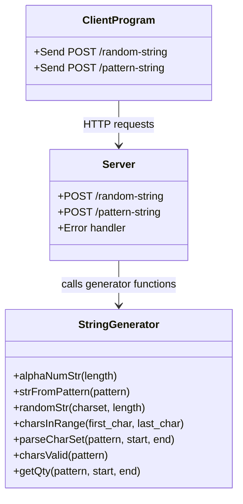
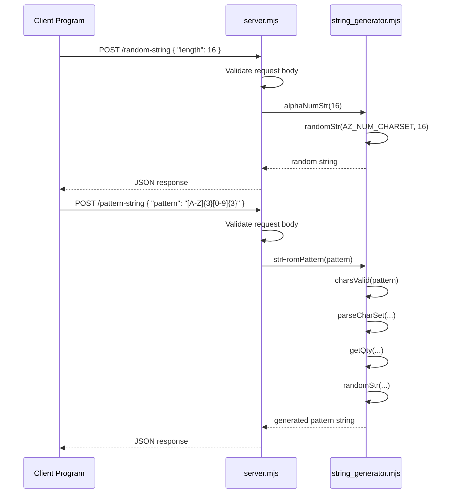

# Random String Generator (RSG) Microservice

## Overview

The **Random String Generator (RSG) Microservice** provides cryptographically secure string generation for client applications.

It supports two main capabilities:

1. **Random alphanumeric string generation**
2. **Pattern-based string generation**

The service is designed to integrate easily into larger systems via **HTTP requests**, allowing teammates to generate IDs, tokens, or formatted strings from any language that can send HTTP requests.

---

## Features

- Cryptographically secure random string generation
- Customizable string length
- Pattern-based string generation
- JSON API responses
- Input validation and error handling
- Easy integration with Python or other client applications

---

## Technologies Used

- **Node.js**
- **Express**
- **crypto** (Node.js built-in module)

---

## File Structure

```text
RSG/
│
├── server.mjs
│   Express server and API routes
│
├── string_generator.mjs
│   Core string generation logic
│
├── test.http
│   REST Client test requests
│
├── package.json
│
└── README.md
```

---

# How to Run the Microservice

### 1. Install dependencies

```bash
npm install
```

### 2. Start the server

```bash
node server.mjs
```

### 3. Expected startup message

```text
Random String Generator listening on port 3000...
```

The microservice runs at:

```text
http://localhost:3000
```

---

# API Endpoints

---

## POST `/random-string`

Generates a secure random alphanumeric string.

### Request Body (Optional)

```json
{
  "length": 16
}
```

If no length is provided, the service uses the default length of **16**.

---

### Success Response

```json
{
  "randomString": "a8Kz19LmQw2PeX7r",
  "length": 16
}
```

---

### Validation Rules

- `length` must be an integer
- `length` must be greater than 0
- `length` must be less than or equal to **256**

---

### Error Example

```json
{
  "error": {
    "code": "BAD_REQUEST",
    "message": "length must be <= 256"
  }
}
```

---

## POST `/pattern-string`

Generates a string based on a provided pattern.

### Request Body (Required)

```json
{
  "pattern": "[A-L!?@]{12}.[m-z/'\"-]{10}"
}
```

---

### Success Response

```json
{
  "pattern_string": "B!K@CFA?LJQx.nv/xtz-qp"
}
```

---

### Error Example

```json
{
  "error": {
    "code": "BAD_REQUEST",
    "message": "request for patterned string must include a pattern"
  }
}
```

---

# Pattern Rules

The `/pattern-string` endpoint supports the following pattern syntax.

---

## Character Sets

Use square brackets to define allowed characters.

```text
[a-z]
[A-Z]
[0-9]
[abcXYZ!?]
```

---

## Character Ranges

A dash inside a charset creates a range.

```text
[a-z]
[A-L]
[m-z]
```

---

## Literal Characters

Characters outside a charset are treated as literal characters.

```text
abc
-
.
_
```

---

## Quantifiers

Curly braces specify quantity.

```text
[a-z]{5}
[0-9]{2,6}
```

Meaning:

```text
{n}   = exactly n characters
{n,m} = between n and m characters
```

---

## Escaped Characters

To include special literal characters, escape them with `\`.

Example:

```text
\]
```

---

# Example Test Requests

These examples can be run using **VS Code REST Client**, **Insomnia**, **Postman**, or **curl**.

```http
# Request random string, default length
POST http://localhost:3000/random-string
Content-Type: application/json

{}

###
# Request random string, custom length
POST http://localhost:3000/random-string
Content-Type: application/json

{ "length": 10 }

###
# Request random string, request too long
POST http://localhost:3000/random-string
Content-Type: application/json

{ "length": 257 }

###
# Request patterned string
POST http://localhost:3000/pattern-string
Content-Type: application/json

{
    "pattern": "[A-L!?@]{12}.[m-z/'\"-]{10}"
}
```

---

# Communication Contract

This section explains how other programs interact with the microservice.

---

## How to REQUEST data from the microservice

A client program sends an **HTTP POST request**.

### Random String Request

```http
POST /random-string
Content-Type: application/json
```

Optional JSON body:

```json
{
  "length": 16
}
```

---

### Pattern String Request

```http
POST /pattern-string
Content-Type: application/json
```

Required JSON body:

```json
{
  "pattern": "[A-Z]{4}[0-9]{4}"
}
```

---

## How to RECEIVE data from the microservice

The service returns **JSON responses**.

### Example response from `/random-string`

```json
{
  "randomString": "aB83kLmZ19Qx",
  "length": 12
}
```

---

### Example response from `/pattern-string`

```json
{
  "pattern_string": "ABCD4821"
}
```

---

### Example error response

```json
{
  "error": {
    "code": "BAD_REQUEST",
    "message": "length must be an integer"
  }
}
```

---

# Example Python Usage

A Python client can call the microservice using the `requests` library.

---

## Random String Example

```python
import requests

response = requests.post(
    "http://localhost:3000/random-string",
    json={"length": 12}
)

data = response.json()
print(data["randomString"])
```

---

## Pattern String Example

```python
import requests

response = requests.post(
    "http://localhost:3000/pattern-string",
    json={"pattern": "[A-Z]{3}[0-9]{3}"}
)

data = response.json()
print(data["pattern_string"])
```

---

# Example Use Cases

This microservice can be used for:

- Workout IDs
- Share codes
- Temporary tags
- Search tokens
- Random identifiers
- Pattern-controlled identifiers
- Session keys
- Data labels

---

# Error Handling

The service returns the following HTTP error types.

---

## 400 BAD_REQUEST

Returned when the client sends invalid input.

Example:

```json
{
  "error": {
    "code": "BAD_REQUEST",
    "message": "length must be an integer"
  }
}
```

---

## 500 INTERNAL_ERROR

Returned when the server encounters an unexpected failure.

Example:

```json
{
  "error": {
    "code": "INTERNAL_ERROR",
    "message": "Service encountered an internal error."
  }
}
```
---

## UML Diagram



### Request Flow


